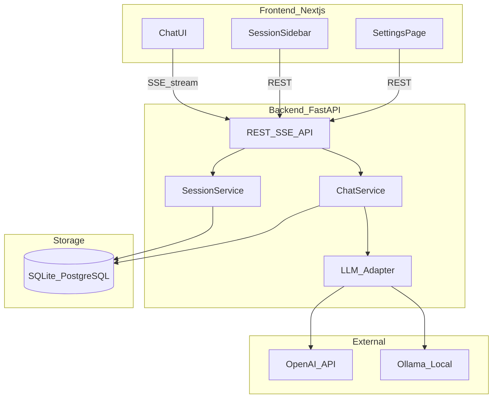
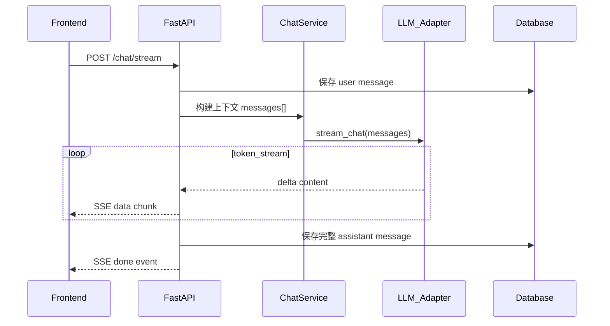
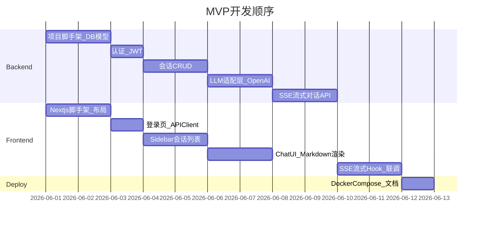

# ChatGPT 风格对话系统 — 技术架构与功能规划

## 一、系统定位

面向个人/小团队自用的 **通用 AI 对话系统**（非 RAG 文档问答为主），核心体验对标 ChatGPT：多轮对话、流式输出、会话历史、Markdown/代码块渲染。

后续可平滑扩展：文档上传、知识库问答、多用户权限等。

---

## 二、整体架构



**通信模式**
- 普通 CRUD：REST JSON
- 对话生成：**SSE（Server-Sent Events）** 流式推送，实现简单、与 ChatGPT 体验一致
- 认证：JWT Bearer Token（MVP 可先做单用户 + 固定 Token，后续再加注册登录）

---

## 三、推荐技术栈

| 层级 | 技术 | 选型理由 |
|------|------|----------|
| 前端框架 | **Next.js 14+ (App Router) + TypeScript** | SSR/路由成熟，生态丰富 |
| UI 组件 | **Tailwind CSS + shadcn/ui** | 快速搭建 ChatGPT 风格界面 |
| 前端状态 | **TanStack Query + Zustand** | 服务端数据缓存 + 轻量 UI 状态 |
| Markdown | **react-markdown + remark-gfm + rehype-highlight** | 表格、代码高亮 |
| 后端框架 | **FastAPI + Python 3.11+** | 异步友好、SSE 原生支持、与你现有 Python 背景契合 |
| ORM | **SQLAlchemy 2.0 + Alembic** | 迁移管理清晰 |
| 数据库 | **SQLite（MVP）→ PostgreSQL（上线）** | 零配置起步，后期无缝切换 |
| LLM 接入 | **OpenAI SDK + Ollama 适配层** | 云端/本地模型可切换 |
| 部署 | **Docker Compose** | 前后端 + DB 一键启动 |

**项目目录建议**

```
chat-doc/
├── backend/
│   ├── app/
│   │   ├── api/          # 路由：sessions, chat, auth, settings
│   │   ├── core/         # 配置、安全、依赖注入
│   │   ├── models/       # SQLAlchemy 模型
│   │   ├── schemas/      # Pydantic 请求/响应
│   │   ├── services/     # 业务逻辑
│   │   └── llm/          # LLM 适配器（OpenAI/Ollama）
│   ├── alembic/
│   └── requirements.txt
├── frontend/
│   ├── app/              # Next.js 页面
│   ├── components/       # ChatMessage, Sidebar, InputBox...
│   ├── hooks/            # useChatStream
│   └── lib/              # API client
└── docker-compose.yml
```

---

## 四、后端功能模块

### 4.1 认证模块（MVP 简化版）

- `POST /api/auth/login` — 用户名密码登录，返回 JWT
- `GET /api/auth/me` — 获取当前用户
- MVP 可预设 1 个管理员账号（环境变量配置），跳过注册流程
- 密码 bcrypt 哈希存储

### 4.2 会话管理

| 接口 | 功能 |
|------|------|
| `GET /api/sessions` | 分页列出会话（按 updated_at 倒序） |
| `POST /api/sessions` | 创建新会话（可选 title） |
| `GET /api/sessions/{id}` | 获取会话详情 + 消息列表 |
| `PATCH /api/sessions/{id}` | 重命名会话 |
| `DELETE /api/sessions/{id}` | 删除会话及全部消息 |

**数据模型**

```
User        → id, username, password_hash, created_at
Session     → id, user_id, title, created_at, updated_at
Message     → id, session_id, role(user/assistant/system), content, token_count, created_at
```

- 首条用户消息后，可调用 LLM 自动生成会话标题（异步，不阻塞对话）

### 4.3 核心对话模块（最重要）

- `POST /api/chat/stream` — SSE 流式对话

**请求体示例**
```json
{
  "session_id": "uuid",
  "message": "用户输入内容",
  "model": "gpt-4o-mini"
}
```

**处理流程**



**关键实现点**
- **上下文窗口管理**：按 token 数截断历史消息（保留 system + 最近 N 轮），避免超出模型限制
- **System Prompt**：可配置默认系统提示词（通过 Settings 或环境变量）
- **错误处理**：LLM 超时/限流时 SSE 推送 error 事件，前端展示友好提示
- **中止生成**：前端 AbortController 断开 SSE，后端检测 disconnect 并停止 LLM 调用

### 4.4 设置模块

- `GET /api/settings` — 获取可用模型列表、默认模型
- `PATCH /api/settings` — 更新用户偏好（默认模型、temperature 等）
- 模型配置通过环境变量 + 数据库偏好合并

### 4.5 LLM 适配层（Strategy 模式）

统一接口，便于切换供应商：

```python
class BaseLLMProvider(Protocol):
    async def stream_chat(self, messages: list[dict], **kwargs) -> AsyncIterator[str]: ...
    async def count_tokens(self, text: str) -> int: ...
```

- **OpenAIProvider**：调用 `openai.AsyncOpenAI`，支持 gpt-4o / gpt-4o-mini
- **OllamaProvider**：调用本地 `http://localhost:11434/api/chat`，支持 llama3、qwen 等
- 通过 `LLM_PROVIDER=openai|ollama` 环境变量切换

---

## 五、前端功能模块

### 5.1 布局（对标 ChatGPT）

```
┌─────────────────────────────────────────────┐
│ [Sidebar 260px]  │  [Main Chat Area]        │
│  + 新对话        │  ┌─────────────────────┐ │
│  会话列表        │  │  MessageList        │ │
│  ─────────       │  │  (scroll)           │ │
│  设置            │  └─────────────────────┘ │
│  退出登录        │  ┌─────────────────────┐ │
│                  │  │  InputBox + 发送    │ │
│                  │  └─────────────────────┘ │
└─────────────────────────────────────────────┘
```

- 移动端：Sidebar 折叠为抽屉（hamburger 菜单）

### 5.2 会话侧边栏

- 展示会话列表（title + 相对时间）
- 点击切换会话，URL 同步为 `/chat/[sessionId]`
- 右键/菜单：重命名、删除
- 「新对话」按钮 → 创建空会话并跳转

### 5.3 聊天主区域

**MessageList 组件**
- 用户消息：右对齐，简洁气泡
- AI 消息：左对齐，Markdown 渲染（标题、列表、表格、代码块）
- 代码块：语法高亮 + 一键复制
- 流式输出：打字机效果，光标闪烁
- 空状态：欢迎页 + 示例 prompt 卡片（点击填入输入框）

**InputBox 组件**
- 多行 textarea，Enter 发送 / Shift+Enter 换行
- 发送中禁用输入，显示「停止生成」按钮
- 模型选择下拉（可选）
- 字符数/Token 提示（可选）

### 5.4 流式对话 Hook

`useChatStream` 封装 SSE 消费逻辑：

```typescript
// 伪代码
const { sendMessage, isStreaming, abort } = useChatStream({
  onDelta: (text) => appendToLastMessage(text),
  onDone: (messageId) => refreshSession(),
  onError: (err) => toast.error(err),
});
```

- 使用 `fetch` + `ReadableStream` 解析 SSE（或 EventSource，POST 场景用 fetch 更合适）
- 支持 AbortController 中止

### 5.5 设置页

- 默认模型选择
- Temperature 滑块（0~1）
- System Prompt 编辑（高级）
- 主题切换：浅色/深色（next-themes）

### 5.6 登录页

- 简洁表单：用户名 + 密码
- JWT 存 localStorage 或 httpOnly cookie（推荐 cookie + 后端 Set-Cookie）

---

## 六、MVP 功能优先级

### P0 — 必须有（第一版可 Demo）

1. 登录（单用户）
2. 创建/切换/删除会话
3. SSE 流式对话
4. Markdown + 代码高亮渲染
5. 消息历史持久化
6. OpenAI API 接入

### P1 — 第二迭代

7. Ollama 本地模型支持
8. 自动生成会话标题
9. 停止生成 / 重新生成
10. 深色模式
11. 会话重命名

### P2 — 后续扩展（对话 + 文档方向）

12. 导出会话为 Markdown/PDF
13. 消息编辑 & 分支对话
14. 文档上传 + RAG 问答（向量库 pgvector / Chroma）
15. 多用户注册 & 权限
16. 对话搜索

---

## 七、关键非功能需求

| 方面 | MVP 方案 |
|------|----------|
| 安全 | JWT 过期、CORS 白名单、API Key 仅存后端环境变量 |
| 性能 | 流式首 Token 延迟 < 2s；会话列表分页 |
| 可观测 | FastAPI 结构化日志；可选 Sentry |
| 测试 | 后端 pytest（service 层单测）；前端 Playwright E2E（可选） |
| 部署 | Docker Compose：`frontend` + `backend` + `db` 三容器 |

---

## 八、环境变量示例

**backend/.env**
```
DATABASE_URL=sqlite:///./chat.db
JWT_SECRET=your-secret-key
LLM_PROVIDER=openai
OPENAI_API_KEY=sk-...
DEFAULT_MODEL=gpt-4o-mini
ADMIN_USERNAME=admin
ADMIN_PASSWORD=changeme
```

**frontend/.env.local**
```
NEXT_PUBLIC_API_URL=http://localhost:8000
```

---

## 九、开发顺序建议



**建议并行**：后端 a1~a3 与前端 b1~b3 可同时进行；a5 完成后前后端联调 b5。

---

## 十、核心依赖版本参考

**backend/requirements.txt（关键包）**
- fastapi, uvicorn[standard]
- sqlalchemy, alembic
- pydantic-settings
- python-jose[cryptography], passlib[bcrypt]
- openai, httpx
- sse-starlette（或手写 StreamingResponse）

**frontend/package.json（关键包）**
- next, react, typescript
- @tanstack/react-query
- tailwindcss, @radix-ui/* (shadcn)
- react-markdown, remark-gfm, rehype-highlight
- zustand, next-themes

---

## 总结

| 维度 | 决策 |
|------|------|
| 架构 | 前后端分离，REST + SSE |
| 后端 | FastAPI + SQLAlchemy + OpenAI/Ollama 适配层 |
| 前端 | Next.js + shadcn/ui + react-markdown |
| 数据库 | SQLite 起步，PostgreSQL 上线 |
| MVP 范围 | 登录 + 会话管理 + 流式对话 + Markdown 渲染 |
| 扩展路径 | RAG 文档问答 → 多用户 → 导出/搜索 |

确认此规划后，可按 P0 清单从 **后端脚手架 + 数据库模型** 和 **前端布局骨架** 两条线并行启动开发。
