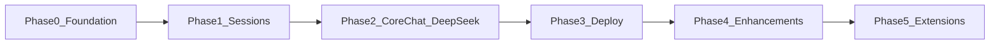
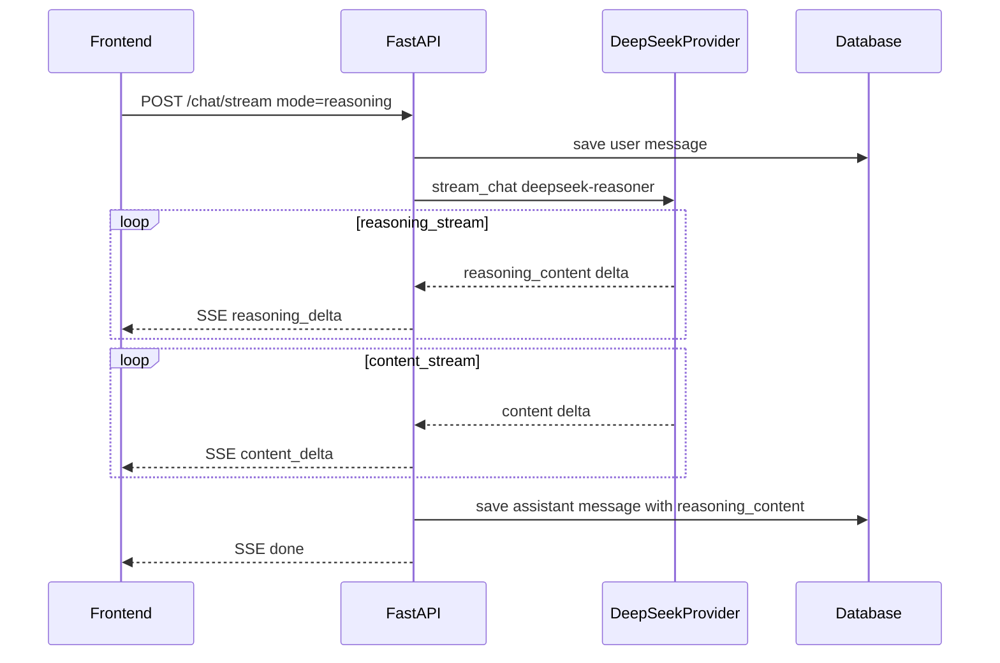

# ChatGPT 对话系统 — Phase 拆分方案（修订版）

## 变更说明

| 变更项 | 原方案 | 修订后 |
|--------|--------|--------|
| 用户认证 | Phase 1 实现 JWT 登录 | **移除**，MVP 无需登录/认证 |
| LLM 供应商 | OpenAI（gpt-4o） | **DeepSeek 系列**（`deepseek-chat` / `deepseek-reasoner`） |
| 对话模式 | 无 | **普通模式 + 推理模式**，前后端均支持切换与展示 |

---

## 拆分原则

基于规划文档 [`.cursor/plans/chatgpt对话系统规划_b74fe7e4.plan.md`](d:\code\cursor_project_1\.cursor\plans\chatgpt对话系统规划_b74fe7e4.plan.md)，拆分为 **Phase 0–5**（共 6 个 Phase）：

- **Phase 0–3**：MVP 可 Demo、可部署
- **Phase 4**：第二迭代增强
- **Phase 5**：长期扩展

每个 Phase 结束时都有可独立验证的交付物；Phase 0–1 前后端可并行。



---

## Phase 0 — 项目基础脚手架

**目标**：前后端项目可启动，数据库模型就绪，布局骨架可见。无认证层。

**交付物**
- `backend/` 目录结构（`app/api`, `core`, `models`, `schemas`, `services`, `llm`）
- SQLAlchemy 模型：`Session`, `Message`（**不含 User 模型**）
- Alembic 初始迁移，SQLite 可连接
- `frontend/` Next.js 14+ App Router + Tailwind + shadcn/ui
- 布局骨架：Sidebar（260px）+ Main Chat Area
- API Client 基础封装 + TanStack Query 全局配置（**无 JWT 拦截**）

**数据模型（修订）**

```
Session  → id, title, created_at, updated_at
Message  → id, session_id, role(user/assistant/system), content, reasoning_content(nullable), token_count, created_at
```

- `reasoning_content`：推理模式下 AI 的思考过程，仅展示/存档用，**不参与后续 API 上下文**

**Todos 映射**
- `p0-backend-scaffold`
- `p0-frontend-scaffold`

**验收标准**
- `uvicorn` 启动后端，健康检查接口返回 200
- `npm run dev` 启动前端，可见 Sidebar + 空白主区域
- `alembic upgrade head` 成功创建表
- 前端可直接调用后端 API，无需登录

**预估**：2–3 天（前后端并行）

---

## ~~Phase 1 认证~~ — 已移除

当前项目 **不需要** 用户登录、JWT、密码哈希等认证模块。以下内容从 MVP 范围中删除：

- ~~`POST /api/auth/login`~~
- ~~`GET /api/auth/me`~~
- ~~登录页、JWT 拦截、401 跳转~~
- ~~`User` 模型、`ADMIN_USERNAME/PASSWORD`、`JWT_SECRET`~~

> 多用户注册与权限保留在 Phase 5 长期扩展中，不作为 MVP 前置条件。

---

## Phase 1 — 会话管理

**目标**：会话 CRUD 完整可用，Sidebar 可新建/切换/删除会话。

**交付物**

后端：

| 接口 | 功能 |
|------|------|
| `GET /api/sessions` | 分页列表，按 `updated_at` 倒序 |
| `POST /api/sessions` | 创建会话 |
| `GET /api/sessions/{id}` | 详情 + 消息列表 |
| `PATCH /api/sessions/{id}` | 重命名 |
| `DELETE /api/sessions/{id}` | 删除会话及消息 |

前端：
- 会话列表（title + 相对时间）
- 「新对话」按钮 → 创建并跳转 `/chat/[sessionId]`
- 点击切换会话，URL 同步
- 删除确认对话框

**Todos 映射**
- `p1-backend-sessions`
- `p1-frontend-sidebar`

**验收标准**
- 创建会话后 Sidebar 即时更新
- 切换会话 URL 与内容一致
- 删除会话后消息一并清除
- 刷新页面会话列表持久化

**依赖**：Phase 0

**预估**：2–3 天（前后端并行）

---

## Phase 2 — 核心对话 + DeepSeek 双模式（MVP 核心）

**目标**：接入 DeepSeek 系列模型，支持普通/推理两种模式，SSE 流式对话端到端跑通。

### 2.1 对话模式定义

| 模式 | 标识 | 模型 | 说明 |
|------|------|------|------|
| 普通模式 | `normal` | `deepseek-chat` | 直接输出最终回答，低延迟 |
| 推理模式 | `reasoning` | `deepseek-reasoner` | 先输出思考过程（CoT），再输出最终回答 |

- 前端 InputBox 区域提供模式切换（Toggle / SegmentedControl）
- 默认模式：`normal`
- 模式选择随请求传入，同一 Session 内可自由切换

### 2.2 后端交付物

**LLM 适配层**
- `DeepSeekProvider`：基于 OpenAI SDK 兼容接口，`base_url=https://api.deepseek.com`
- 环境变量：`DEEPSEEK_API_KEY`、`DEFAULT_MODEL=deepseek-chat`
- 根据 `mode` 参数路由到对应模型

**流式对话 API** — `POST /api/chat/stream`

请求体示例：
```json
{
  "session_id": "uuid",
  "message": "用户输入内容",
  "mode": "normal"
}
```

SSE 事件类型（推理模式需区分两类 delta）：

| event | 字段 | 说明 |
|-------|------|------|
| `reasoning_delta` | `content` | 推理模式：思考过程 token 流 |
| `content_delta` | `content` | 最终回答 token 流 |
| `done` | `message_id` | 生成完成 |
| `error` | `message` | 错误信息 |

**关键实现点**
- 上下文构建：**只传 `content`，不传 `reasoning_content`** 给 DeepSeek API（否则 400 错误）
- 持久化：推理模式下 `Message.reasoning_content` 存完整思考过程，`content` 存最终回答
- 上下文窗口管理：token 截断，保留 system + 最近 N 轮
- 中止检测：客户端 disconnect → 停止 LLM 调用
- 错误处理：超时/限流 → SSE `error` event

### 2.3 前端交付物

**聊天 UI**
- `MessageList`：用户气泡右对齐，AI 左对齐 Markdown 渲染
- `ReasoningBlock` 组件（推理模式专属）：
  - 可折叠「思考过程」区域，默认展开、流式更新
  - 样式：灰色/次要色调，与最终回答视觉区分
- 代码块语法高亮 + 一键复制
- 流式打字机效果 + 光标闪烁
- 空状态欢迎页 + 示例 prompt 卡片

**InputBox**
- 模式切换器：普通模式 / 推理模式
- Enter 发送 / Shift+Enter 换行，发送中禁用
- 发送中显示「停止生成」按钮

**useChatStream Hook**
- 解析 SSE：区分 `reasoning_delta` 与 `content_delta`
- `onReasoningDelta` / `onContentDelta` 回调
- `AbortController` 中止

**Todos 映射**
- `p2-backend-deepseek` — DeepSeekProvider + 双模式路由
- `p2-backend-stream` — SSE 流式 API + reasoning_content 持久化
- `p2-frontend-chat` — MessageList + ReasoningBlock + InputBox 模式切换
- `p2-frontend-stream` — useChatStream 双 delta 解析 + 联调

**验收标准**
- 普通模式：发送消息后流式输出最终回答，无思考过程区域
- 推理模式：先流式展示思考过程，再流式展示最终回答
- 切换模式后新消息使用对应模型，历史消息正确渲染
- Markdown 和代码块正确渲染
- 刷新页面后消息历史（含 reasoning_content）完整
- 断开 SSE 后后端停止生成
- 多轮对话上下文正确（reasoning_content 不传入 API）

**依赖**：Phase 1

**预估**：5–6 天（DeepSeek 适配 2d → SSE 双 delta 2d → 前端 UI 2d → 联调 1d）



---

## Phase 3 — 部署与 MVP 交付

**目标**：Docker Compose 一键启动，环境变量文档齐全，MVP 可 Demo。

**交付物**
- `docker-compose.yml`：`frontend` + `backend` + `db`（可选 PostgreSQL）
- `backend/.env.example`、`frontend/.env.local.example`
- README：启动步骤、环境变量说明

**环境变量（修订）**

`backend/.env`：
```
DATABASE_URL=sqlite:///./chat.db
DEEPSEEK_API_KEY=sk-...
DEFAULT_MODEL=deepseek-chat
DEFAULT_MODE=normal
```

`frontend/.env.local`：
```
NEXT_PUBLIC_API_URL=http://localhost:8000
```

**Todos 映射**
- `p3-deploy`

**验收标准**
- `docker compose up` 后前后端均可访问
- 完整走通：新建会话 → 普通模式对话 → 推理模式对话 → 刷新恢复
- `DEEPSEEK_API_KEY` 仅存后端环境变量，前端无泄露

**依赖**：Phase 2

**预估**：1 天

**MVP 里程碑**：Phase 3 完成 = 可对外 Demo。

---

## Phase 4 — 体验增强

**目标**：提升日常使用体验与个性化配置。

**功能清单**

| # | 功能 | 涉及模块 |
|---|------|----------|
| 1 | 自动生成会话标题 | ChatService 异步调用 deepseek-chat |
| 2 | 停止生成 / 重新生成 | AbortController + 重新生成 API |
| 3 | 深色模式 | next-themes |
| 4 | 会话重命名 UI | Sidebar 右键菜单（API 已在 Phase 1） |
| 5 | 设置页 | 默认模式、Temperature、System Prompt |
| 6 | Ollama 本地模型（可选） | `OllamaProvider` 作为第二 Provider |

**额外交付**
- `GET/PATCH /api/settings` — 默认模式（normal/reasoning）、temperature、system prompt

**验收标准**
- 首条消息后自动生成标题
- 推理模式思考过程可折叠/展开
- 深色/浅色主题切换正常

**依赖**：Phase 3

**预估**：3–5 天

---

## Phase 5 — 长期扩展

**目标**：文档问答、多用户、高级对话能力。按需迭代。

**功能清单**

| # | 功能 | 技术方向 |
|---|------|----------|
| 1 | 用户认证 & 多用户 | JWT / OAuth + RBAC（从 MVP 移至此） |
| 2 | 导出会话 Markdown/PDF | 后端生成 + 前端下载 |
| 3 | 消息编辑 & 分支对话 | 消息树模型扩展 |
| 4 | 文档上传 + RAG 问答 | pgvector / Chroma |
| 5 | 对话搜索 | 全文索引 |

**依赖**：Phase 4

---

## 文档结构调整建议

```markdown
# ChatGPT 风格对话系统 — 技术架构与功能规划

## 一、系统定位          （保留，注明 MVP 无认证）
## 二、整体架构          （保留，移除 Auth 节点）
## 三、推荐技术栈        （LLM 改为 DeepSeek，移除 JWT 相关包）
## 四、Phase 总览        （Phase 0–5 表格 + 依赖图）
## 五、Phase 0–3 详细规格 （MVP，含 DeepSeek 双模式）
## 六、Phase 4–5 详细规格 （增强与扩展，认证移入 Phase 5）
## 七、非功能需求        （移除 JWT，保留 CORS + API Key 安全）
## 八、环境变量          （DEEPSEEK_API_KEY 替换 OPENAI_API_KEY）
## 九、依赖版本          （保留）
## 十、总结              （更新里程碑）
```

**Frontmatter todos 重组**：

```yaml
todos:
  # Phase 0
  - id: p0-backend-scaffold
    content: FastAPI 脚手架 + Session/Message 模型 + Alembic（无 User）
  - id: p0-frontend-scaffold
    content: Next.js 脚手架 + 布局 + API Client + TanStack Query（无认证）
  # Phase 1
  - id: p1-backend-sessions
    content: 会话 CRUD API
  - id: p1-frontend-sidebar
    content: 会话侧边栏
  # Phase 2
  - id: p2-backend-deepseek
    content: DeepSeekProvider + 普通/推理双模式路由
  - id: p2-backend-stream
    content: SSE 流式 API + reasoning_content 持久化与上下文过滤
  - id: p2-frontend-chat
    content: MessageList + ReasoningBlock + InputBox 模式切换
  - id: p2-frontend-stream
    content: useChatStream 双 delta 解析 + 前后端联调
  # Phase 3
  - id: p3-deploy
    content: Docker Compose + 环境变量文档
  # Phase 4
  - id: p4-auto-title
  - id: p4-stop-regenerate
  - id: p4-dark-mode
  - id: p4-settings
  # Phase 5
  - id: p5-auth-multiuser
  - id: p5-rag
  - id: p5-export-search
```

---

## 并行开发建议

| 时间段 | 后端 | 前端 |
|--------|------|------|
| Phase 0 | 脚手架 + DB 模型 | 脚手架 + 布局 + API Client |
| Phase 1 | 会话 CRUD | Sidebar |
| Phase 2 | DeepSeek + SSE 双 delta | Chat UI + ReasoningBlock + Hook → **联调** |
| Phase 3 | Docker + 文档 | Docker + 文档 |

Phase 0–1 可双线并行；Phase 2 前端 UI 可与后端 DeepSeek 适配并行，**SSE 联调需等 stream API 就绪**。

---

## Phase 与里程碑对照

| Phase | 里程碑 |
|-------|--------|
| Phase 0 | 项目可启动，无认证 |
| Phase 1 | 会话管理可用 |
| Phase 2 | DeepSeek 双模式流式对话可用 |
| Phase 3 | MVP 可 Demo、可部署 |
| Phase 4 | 日常体验完善 |
| Phase 5 | 产品化扩展（含认证） |
